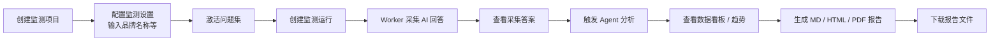

# AI 应用监测平台操作手册

> 本文档面向平台使用者与运维人员，说明从**输入品牌名称**开始，到**查看数据看板**与**导出监测报告**的完整操作流程。  
> 更新日期：2026-06-30  
> 接口细节见 [API接口文档.md](./API接口文档.md)；在线 Swagger：`http://127.0.0.1:8000/docs`

---

## 目录

- [1. 平台简介](#1-平台简介)
- [2. 业务流程总览](#2-业务流程总览)
- [3. 环境准备](#3-环境准备)
- [4. 启动服务](#4-启动服务)
- [5. 完整操作流程](#5-完整操作流程)
  - [5.1 创建监测项目](#51-创建监测项目)
  - [5.2 配置监测设置（从品牌名称开始）](#52-配置监测设置从品牌名称开始)
  - [5.3 确认 AI 平台可用](#53-确认-ai-平台可用)
  - [5.4 创建监测运行（采集）](#54-创建监测运行采集)
  - [5.5 等待采集完成并查看答案](#55-等待采集完成并查看答案)
  - [5.6 触发 Agent 分析](#56-触发-agent-分析)
  - [5.7 查看数据看板与趋势](#57-查看数据看板与趋势)
  - [5.8 生成并下载报告](#58-生成并下载报告)
- [6. 可选：定时自动监测](#6-可选定时自动监测)
- [7. 运行状态说明](#7-运行状态说明)
- [8. 常见问题与排错](#8-常见问题与排错)
- [9. 自动化验证](#9-自动化验证)
- [10. 相关文档](#10-相关文档)

---

## 1. 平台简介

AI 应用监测平台用于：

1. **配置监测对象**：目标品牌、竞品、核心词、AI 提问问题、监测平台；
2. **采集 AI 回答**：向通义千问、DeepSeek 等 AI 平台发送问题，获取原始回答与引用；
3. **确定性指标计算**：品牌提及率、首推率、竞品对比等由程序计算，不由 LLM 改写；
4. **Agent 语义分析**：生成竞争力摘要、改进建议等语义洞察；
5. **看板与报告**：汇总最新运行结果，支持趋势对比与 MD/HTML/PDF 报告导出。

当前阶段后端 API 已完整实现上述流水线；前端界面可按同一接口对接。

---

## 2. 业务流程总览



**阶段依赖关系（必须按顺序）：**

| 阶段 | 前置条件 | 产出 |
| --- | --- | --- |
| 配置 | 数据库、Redis 可用 | 项目 ID、激活的问题集 |
| 采集 | 至少 1 个 AI 平台已启用且有密钥；collection worker 运行中 | 答案文本、引用、品牌识别结果 |
| 分析 | 采集已完成；Agent LLM 已配置 | 平台指标、语义洞察 |
| 看板 | 分析已完成（或仅有采集数据时显示采集摘要） | 汇总指标、分平台明细 |
| 报告 | 分析已完成 | MD / HTML / PDF 文件 |

---

## 3. 环境准备

### 3.1 基础设施

| 组件 | 用途 | 说明 |
| --- | --- | --- |
| PostgreSQL | 业务数据存储 | 需执行 Alembic 迁移或导入 `docs/geo-platform_schema.sql` |
| Redis | Dramatiq 消息队列 | 采集、分析、报告异步任务 |
| 外部 AI 平台密钥 | 采集阶段 | 如 `QWEN_API_KEYS`、`DEEPSEEK_API_KEYS` |
| 模力指数 API Token | 第三方端侧采集 | 启用 `collection_source=molizhishu` 时配置 `MOLIZHISHU_ENABLED=true` 与 `MOLIZHISHU_API_TOKEN` |
| Agent LLM | 分析阶段 | `.env` 中 `AGENT_LLM_*` 配置 |

### 3.2 配置文件

1. 复制根目录 `.env.example` 为 `.env`；
2. 填入真实连接信息（**勿提交 `.env` 到 Git**）：

```env
DATABASE_URL=postgresql+psycopg2://<user>:<password>@<host>:5432/geo_platform
REDIS_URL=redis://:<password>@<host>:6379/0

# 至少启用一个采集平台并配置密钥
QWEN_ENABLED=true
QWEN_API_KEYS=sk-xxx
QWEN_MODEL=qwen-plus

# Agent 分析 LLM（OpenAI 兼容接口）
AGENT_LLM_BASE_URL=https://dashscope.aliyuncs.com/compatible-mode/v1
AGENT_LLM_API_KEY=sk-xxx
AGENT_LLM_MODEL=qwen-plus

REPORT_STORAGE_DIR=./data/reports

# 生产环境必须开启业务 API 鉴权
API_AUTH_ENABLED=false
API_AUTH_BEARER_TOKENS=

# 可选：第三方模力指数端侧采集
MOLIZHISHU_ENABLED=false
MOLIZHISHU_API_TOKEN=
MOLIZHISHU_PROVIDER_BATCH_ENABLED=true
```

`APP_ENV=prod` 时，后端会对 `DRAMATIQ_BROKER=redis`、`AGENT_LLM_*`、`API_AUTH_*` 以及已启用的模力指数 token 做 fail-fast 校验；缺失配置会导致服务启动失败，而不是在采集或分析时才报错。

### 3.3 数据库初始化

**方式 A（推荐，有代码环境）：**

```powershell
cd backend
.venv\Scripts\alembic.exe upgrade head
```

**方式 B（无代码部署，Navicat 执行 SQL）：**

见 [PostgreSQL远程建表操作文档_无需部署代码.md](./PostgreSQL远程建表操作文档_无需部署代码.md)。

### 3.4 健康检查

服务启动后，确认以下接口返回正常：

```bash
# 全局就绪（数据库 + Redis）
curl http://127.0.0.1:8000/api/ready

# 监测服务就绪
curl http://127.0.0.1:8000/api/geo-monitoring/ready
```

`data.status` 为 `ready` 表示数据库与 Redis 可用；监测服务就绪接口还会返回 `platform_runtime`，用于查看 DB 中已启用平台是否具备运行时 adapter 与凭证。若 `platform_runtime.collection_ready=false`，先补 `.env` 或关闭对应平台后再创建运行。

---

## 4. 启动服务

监测流水线需要 **API 服务** 与 **Dramatiq Worker** 同时运行；定时监测还需 **Scheduler**。

### 4.1 本地开发（PowerShell）

**终端 1 — API：**

```powershell
cd backend
.venv\Scripts\uvicorn.exe app.main:app --host 0.0.0.0 --port 8000 --reload
```

**终端 2 — Worker（本地简化：采集 + 分析 + 报告）：**

```powershell
cd backend
.venv\Scripts\dramatiq.exe app.worker.actors.collection app.worker.actors.analysis app.worker.actors.report -Q collection -Q analysis -Q report --processes 2 --threads 1
```

生产部署推荐拆分为三个独立 worker，避免 `collection` 积压时影响 `analysis` 或 `report`：

```powershell
# 采集 worker：外部平台调用、模力指数 ProviderBatch 提交与轮询
.venv\Scripts\dramatiq.exe app.worker.actors.collection -Q collection --processes 4 --threads 2

# 分析 worker：确定性指标与 Agent LLM 洞察
.venv\Scripts\dramatiq.exe app.worker.actors.analysis -Q analysis --processes 1 --threads 1

# 报告 worker：异步报告生成/清理任务
.venv\Scripts\dramatiq.exe app.worker.actors.report -Q report --processes 1 --threads 1
```

**终端 3 — Scheduler（可选，定时任务）：**

```powershell
cd backend
$env:SCHEDULER_ENABLED="true"
.venv\Scripts\python.exe -m app.scheduler.main
```

### 4.2 Docker Compose 部署

```powershell
# 首次：构建镜像并执行迁移
docker compose build
docker compose run --rm api python -m alembic -c backend/alembic.ini upgrade head

# 启动 API、拆分 Worker、Scheduler
docker compose up -d api worker-collection worker-analysis worker-report scheduler
```

默认 API 端口：`8000`（可通过 `.env` 中 `BACKEND_PORT` 修改）。
若当前 compose 文件仍保留 all-in-one `worker` 服务，可临时使用 `docker compose up -d api worker scheduler`；生产建议改为 `worker-collection`、`worker-analysis`、`worker-report` 三服务。

### 4.3 启动检查清单

- [ ] `/api/ready` 返回 `ready`
- [ ] `/api/geo-monitoring/ready` 的 `platform_runtime.collection_ready=true`
- [ ] `/api/geo-monitoring/platforms?page=1&page_size=10` 能列出平台
- [ ] 目标 AI 平台 `enabled=true` 且 `.env` 中对应 `*_ENABLED=true`、模型和密钥齐全；模力指数平台还需 `MOLIZHISHU_ENABLED=true` 与 token
- [ ] Worker 进程在运行（否则创建运行后任务会一直排队）

---

## 5. 完整操作流程

下文以 **Base URL = `http://127.0.0.1:8000`**、**API 前缀 = `/api/geo-monitoring`** 为例。  
所有 JSON 接口成功时返回 `"code": 0`。

> **推荐路径**：使用 **监测设置** 接口一次性完成品牌、竞品、核心词、问题与平台配置（对应产品「品牌诊断/监测设置」页）。  
> 也可分步调用品牌、核心词、问题集等独立接口，效果等价。

---

### 5.1 创建监测项目

每个品牌监测对应一个**监测项目**，用于隔离配置与历史运行数据。

**请求：**

```bash
curl -X POST "http://127.0.0.1:8000/api/geo-monitoring/projects" \
  -H "Content-Type: application/json" \
  -d '{
    "project_name": "杭州宋城文旅监测",
    "industry": "文旅演艺",
    "timezone": "Asia/Shanghai",
    "official_domain": "songcn.com",
    "report_title": "杭州宋城 AI 可见度监测报告",
    "report_subtitle": "2026年6月"
  }'
```

**记录返回的 `data.id`**，下文记为 `{project_id}`（示例：`1`）。

**可选 — 查询已有项目：**

```bash
curl -G "http://127.0.0.1:8000/api/geo-monitoring/projects" \
  --data-urlencode "page=1" \
  --data-urlencode "page_size=10" \
  --data-urlencode "status=active"
```

---

### 5.2 配置监测设置（从品牌名称开始）

这是用户操作的**核心起点**：输入目标品牌名称，并一并配置竞品、核心词、AI 问题与监测平台。

#### 5.2.1 查看当前设置

```bash
curl "http://127.0.0.1:8000/api/geo-monitoring/projects/{project_id}/monitor-setup"
```

首次调用时 `brand` 为空，需通过保存接口写入。

#### 5.2.2 保存监测设置

**字段说明：**

| 字段 | 说明 |
| --- | --- |
| `brand.brand_name` | **目标品牌名称**（必填） |
| `brand.brand_words` | 品牌别名/简称，用于文本匹配（如「宋城」「SEP」） |
| `brand.official_domain` | 官方域名（可选） |
| `competitors` | 竞品列表，每项含 `brand_name` 与 `competitor_words` |
| `core_keywords` | 业务核心词，用于组织监测问题 |
| `ai_questions` | 向 AI 平台提问的问题；可手写 `prompt_text` 或引用词库 `library_prompt_code` |
| `selected_platform_codes` | 参与监测的平台，如 `qwen`、`deepseek` |
| `activate_prompt_set` | 设为 `true` 时，保存后自动激活问题集（**创建运行前必须激活**） |

**完整示例：**

```bash
curl -X PUT "http://127.0.0.1:8000/api/geo-monitoring/projects/{project_id}/monitor-setup" \
  -H "Content-Type: application/json" \
  -d '{
    "brand": {
      "brand_name": "杭州宋城",
      "official_domain": "songcn.com",
      "description": "文旅演艺目标品牌",
      "brand_words": ["宋城", "杭州宋城", "宋城演艺"]
    },
    "competitors": [
      {
        "brand_name": "横店影视城",
        "competitor_words": ["横店", "横店影视城"]
      },
      {
        "brand_name": "长隆",
        "competitor_words": ["长隆"]
      }
    ],
    "core_keywords": [
      {"keyword": "主题乐园", "description": "主题乐园推荐场景", "sort_order": 1, "enabled": true},
      {"keyword": "亲子游", "sort_order": 2, "enabled": true}
    ],
    "ai_questions": [
      {
        "core_keyword": "主题乐园",
        "prompt_text": "国内有哪些值得推荐的主题乐园？请列出 TOP5 并说明理由。"
      },
      {
        "core_keyword": "亲子游",
        "prompt_text": "周末带小孩去杭州周边玩，有哪些主题乐园或景区推荐？"
      },
      {
        "library_prompt_code": "LIB_RECOMMEND_001",
        "core_keyword": "主题乐园"
      }
    ],
    "selected_platform_codes": ["qwen", "deepseek"],
    "activate_prompt_set": true
  }'
```

**保存成功后确认：**

- `data.brand.brand_name` 为目标品牌；
- `data.active_prompt_set_id` 不为空（已激活问题集）；
- `data.ai_questions` 中每条问题均有 `prompt_type`（系统自动推断）。

**常见错误：**

| code | 含义 | 处理 |
| --- | --- | --- |
| `40028` | 缺少品牌 | 在 `brand` 中填写 `brand_name` |
| `40025` | 平台不可用 | 检查平台是否 `enabled` 且 `.env` 密钥已配置 |
| `40026` | 问题文本为空 | 每条 `ai_questions` 需有 `prompt_text` 或有效 `library_prompt_code` |
| `40027` | 核心词不存在 | `ai_questions.core_keyword` 须先出现在 `core_keywords` 中 |

#### 5.2.3 分步配置（可选替代方案）

若不用监测设置接口，可按以下顺序单独操作：

1. `POST /projects/{project_id}/brands` — 创建目标品牌（`brand_type=target`）与竞品；
2. `POST /brands/{brand_id}/aliases` — 添加品牌别名；
3. `POST /projects/{project_id}/core-keywords` — 添加核心词；
4. `POST /projects/{project_id}/prompt-sets` — 创建问题集（草稿）；
5. `POST /prompt-sets/{prompt_set_id}/prompts` — 添加问题；
6. `POST /prompt-sets/{prompt_set_id}/activate` — **激活问题集**。

---

### 5.3 确认 AI 平台可用

创建运行前，确认所选平台已启用：

```bash
curl -G "http://127.0.0.1:8000/api/geo-monitoring/platforms" \
  --data-urlencode "page=1" \
  --data-urlencode "page_size=20" \
  --data-urlencode "enabled=true"
```

若目标平台未启用，可手动开启：

```bash
curl -X PUT "http://127.0.0.1:8000/api/geo-monitoring/platforms/qwen" \
  -H "Content-Type: application/json" \
  -d '{"enabled": true, "max_concurrency": 5}'
```

**支持的平台编码：**

- 官方直连：`doubao`、`qwen`、`yuanbao`、`deepseek`、`kimi`。
- 模力指数第三方端侧：`molizhishu_deepseek_web`、`molizhishu_deepseek_mobile`、`molizhishu_doubao_web`、`molizhishu_doubao_mobile`、`molizhishu_yuanbao_web`、`molizhishu_kimi_web`、`molizhishu_qianwen_web`、`molizhishu_quark_web`、`molizhishu_baiduai_web`、`molizhishu_weibo_zhisou_web`、`molizhishu_wenxinyiyan_web`。

一次 Run 只能选择同一采集来源的平台：默认 `collection_source=official` 只能传官方平台码；`collection_source=molizhishu` 只能传 `molizhishu_*` 平台码。

---

### 5.4 创建监测运行（采集）

监测运行 = 一次完整的「向 AI 平台提问并采集回答」任务。  
系统会为 **每个（问题 × 平台）** 生成一条查询任务，由 Worker 异步执行。

**请求：**

```bash
curl -X POST "http://127.0.0.1:8000/api/geo-monitoring/runs" \
  -H "Content-Type: application/json" \
  -d '{
    "project_id": {project_id},
    "platform_codes": ["qwen", "deepseek"]
  }'
```

| 参数 | 说明 |
| --- | --- |
| `project_id` | 必填，监测项目 ID |
| `prompt_set_id` | 可选；不传则使用当前 **active** 问题集 |
| `platform_codes` | 可选；不传则使用项目默认或全部已启用平台 |
| `collection_source` | 可选；默认 `official`，第三方端侧采集传 `molizhishu` |

**记录返回的 `data.id`**，下文记为 `{run_id}`。

**响应关键字段：**

```json
{
  "code": 0,
  "data": {
    "id": 16,
    "run_no": "RUN-20260622-0016",
    "status": "collecting",
    "collection_status": "collecting",
    "total_tasks": 4,
    "succeeded_tasks": 0,
    "failed_tasks": 0,
    "platform_codes": ["qwen", "deepseek"]
  }
}
```

**模力指数第三方采集示例：**

```bash
curl -X POST "http://127.0.0.1:8000/api/geo-monitoring/runs" \
  -H "Content-Type: application/json" \
  -d '{
    "project_id": {project_id},
    "collection_source": "molizhishu",
    "platform_codes": ["molizhishu_doubao_web", "molizhishu_kimi_web"],
    "provider_mode_by_platform": {
      "molizhishu_doubao_web": "search",
      "molizhishu_kimi_web": "standard"
    },
    "provider_screenshot": 1
  }'
```

模力指数 Run 会在创建前校验平台 DB 启用状态、adapter 注册和 token；启用 ProviderBatch 时会按 run 级拆批提交并通过轮询或回调入库结果。

**常见错误：**

| code | 含义 |
| --- | --- |
| `40030` | 无激活的问题集 — 回到 5.2 激活问题集 |
| `40901` | 问题集内无可用问题 |
| `40902` / `40031` | 无可用 AI 平台 |
| `40908` | 平台 DB 已启用但运行时 adapter / 凭证未配置 |

---

### 5.5 等待采集完成并查看答案

#### 5.5.1 轮询运行状态

```bash
curl "http://127.0.0.1:8000/api/geo-monitoring/runs/{run_id}"
```

**采集终态：**

| `status` | 含义 | 可否继续分析 |
| --- | --- | --- |
| `completed` | 全部任务成功 | 是 |
| `partial_success` | 部分成功 | 是（按有效答案分析） |
| `failed` | 全部失败 | 需排查后重试 |
| `cancelled` | 已取消 | 否 |

当 `succeeded_tasks > 0` 且状态为 `completed` 或 `partial_success` 时，可进入分析阶段。

**典型等待时间：** 取决于问题数量、平台数量与外部 API 响应，单次运行通常 **1～10 分钟**。建议每 **5 秒** 轮询一次。

#### 5.5.2 查看采集任务明细

```bash
curl -G "http://127.0.0.1:8000/api/geo-monitoring/runs/{run_id}/tasks" \
  --data-urlencode "page=1" \
  --data-urlencode "page_size=100"
```

每条任务的 `status` 为 `success` / `failed` / `running` 等；失败任务可查看 `error_message`。

**重试失败任务：**

```bash
curl -X POST "http://127.0.0.1:8000/api/geo-monitoring/runs/{run_id}/retry-failed"
```

#### 5.5.3 查看采集答案列表

```bash
curl -G "http://127.0.0.1:8000/api/geo-monitoring/runs/{run_id}/answers" \
  --data-urlencode "page=1" \
  --data-urlencode "page_size=50"
```

#### 5.5.4 查看单条答案详情

```bash
curl "http://127.0.0.1:8000/api/geo-monitoring/answers/{answer_id}"
```

详情包含：

- `raw_text` / `normalized_text` — AI 原始回答；
- `citations[]` — 引用来源（标题、URL、域名）；
- `brand_results[]` — 各品牌是否被提及、提及次数、首推位置、情感等。

---

### 5.6 触发 Agent 分析

采集完成后，调用分析接口。接口会先校验 Agent LLM 配置，然后把分析任务投递到 `analysis` 队列；worker 异步执行时会：

1. 计算确定性指标（提及率、首推率、完整率等）；
2. 调用 Agent LLM 生成语义摘要与改进建议；
3. 写入指标快照，供看板与趋势使用。

**请求：**

```bash
curl -X POST "http://127.0.0.1:8000/api/geo-monitoring/runs/{run_id}/analyze"
```

> 该接口通常会快速返回 `queued=true`。真实 LLM 分析耗时取决于答案量与模型响应，建议每 5 秒轮询 `GET /runs/{run_id}`，直到 `analysis_status=completed`。

**成功响应示例：**

```json
{
  "code": 0,
  "data": {
    "run_id": 16,
    "analysis_status": "pending",
    "queued": true,
    "run_analysis_status": "pending"
  }
}
```

**等待分析完成：**

```bash
curl "http://127.0.0.1:8000/api/geo-monitoring/runs/{run_id}"
```

#### 5.6.1 查看平台分析指标

```bash
curl "http://127.0.0.1:8000/api/geo-monitoring/runs/{run_id}/analysis"
```

**关注字段（`platforms[]` 内）：**

| 字段 | 说明 |
| --- | --- |
| `brand_mention_rate` | 品牌提及率 |
| `brand_first_rate` | 品牌首推率 |
| `valid_answer_count` | 有效答案数 |
| `data_completeness_rate` | 数据完整率 |
| `top_competitors` | 主要竞品 JSON |
| `top_sources` | 主要引用来源 |
| `prompt_competitiveness_summary` | 问题竞争力摘要 |
| `improvement_json` | 改进建议 |

#### 5.6.2 查看 Agent 执行审计（可选）

```bash
curl -G "http://127.0.0.1:8000/api/geo-monitoring/runs/{run_id}/agent-executions" \
  --data-urlencode "page=1" \
  --data-urlencode "page_size=50"
```

用于排查 LLM 调用耗时、Token 用量与错误信息。

**常见错误：**

| code | 含义 |
| --- | --- |
| `40910` | 采集未完成 — 等待 5.5 终态后再分析 |
| `40911` | 分析正在进行中 — 不要重复触发，继续轮询 |
| `50301` | Agent LLM 配置不完整 — 补齐 `AGENT_LLM_*` |

---

### 5.7 查看数据看板与趋势

#### 5.7.1 项目看板汇总

展示项目**最新一次运行**（或指定运行）的采集与分析摘要。

```bash
# 默认：最近已分析/已采集运行
curl "http://127.0.0.1:8000/api/geo-monitoring/projects/{project_id}/dashboard"

# 指定某次运行
curl -G "http://127.0.0.1:8000/api/geo-monitoring/projects/{project_id}/dashboard" \
  --data-urlencode "run_id={run_id}"
```

**响应结构：**

| 字段 | 说明 |
| --- | --- |
| `latest_run` | 运行摘要：`run_id`、`status`、`analysis_status`、任务计数、完整率等 |
| `summary` | 跨平台汇总指标（分析完成后有值） |
| `platforms` | 分平台采集/分析明细 |

**前端看板建议展示：**

- 最新运行状态与完成时间；
- 品牌提及率、首推率、有效答案数；
- 分平台对比卡片；
- 主要竞品与引用来源 Top 列表（来自 `summary` / `platforms`）。

#### 5.7.2 指标趋势

同一 Prompt 集版本下，多次运行的指标变化（用于折线图）。

```bash
curl -G "http://127.0.0.1:8000/api/geo-monitoring/projects/{project_id}/trends" \
  --data-urlencode "metric_code=brand_mention_rate" \
  --data-urlencode "platform_code=qwen" \
  --data-urlencode "page=1" \
  --data-urlencode "page_size=50"
```

**常用 `metric_code`：**

| 编码 | 含义 |
| --- | --- |
| `brand_mention_rate` | 品牌提及率 |
| `brand_first_rate` | 品牌首推率 |
| `data_completeness_rate` | 数据完整率 |

> 首次运行趋势点可能为空；需在同一激活问题集版本下多次运行后才有对比意义。

#### 5.7.3 历史运行列表

```bash
curl -G "http://127.0.0.1:8000/api/geo-monitoring/runs" \
  --data-urlencode "project_id={project_id}" \
  --data-urlencode "page=1" \
  --data-urlencode "page_size=20"
```

---

### 5.8 生成并下载报告

分析完成后，可导出 Markdown、HTML 与 PDF 格式监测报告。

#### 5.8.1 生成报告

```bash
curl -X POST "http://127.0.0.1:8000/api/geo-monitoring/runs/{run_id}/reports" \
  -H "Content-Type: application/json" \
  -d '{"formats": ["md", "html", "pdf"]}'
```

**响应示例：**

```json
{
  "code": 0,
  "data": {
    "run_id": 16,
    "reports": [
      {"id": 9, "format": "md", "status": "completed", "file_name": "report_16.md", "checksum": "..."},
      {"id": 10, "format": "html", "status": "completed", "file_name": "report_16.html", "checksum": "..."},
      {"id": 11, "format": "pdf", "status": "completed", "file_name": "report_16.pdf", "checksum": "..."}
    ]
  }
}
```

记录各报告的 `id` 为 `{report_id}`。

#### 5.8.2 查询报告状态

```bash
curl "http://127.0.0.1:8000/api/geo-monitoring/reports/{report_id}"
```

`status` 为 `completed` 且 `file_size > 0` 时可下载。

#### 5.8.3 下载报告文件

```bash
# 保存为本地文件（curl 自动按 Content-Disposition 命名）
curl -O -J "http://127.0.0.1:8000/api/geo-monitoring/reports/{report_id}/download"
```

**Windows PowerShell 示例：**

```powershell
Invoke-WebRequest `
  -Uri "http://127.0.0.1:8000/api/geo-monitoring/reports/9/download" `
  -OutFile ".\report_run16.md"
```

报告默认存储目录由 `.env` 中 `REPORT_STORAGE_DIR` 控制（默认 `./data/reports`）。

#### 5.8.4 报告内容说明

| 格式 | 用途 |
| --- | --- |
| `md` | 便于归档、二次编辑、接入文档系统 |
| `html` | 便于浏览器直接阅读、邮件或内部分享 |
| `pdf` | 便于正式交付、离线传阅和归档 |

报告通常包含：项目信息、运行摘要、分平台指标、竞品对比、引用来源、Agent 改进建议等。

**常见错误：**

| code | 含义 |
| --- | --- |
| `40920` | 分析未完成 — 先完成 5.6 |
| `40921` | 报告尚未生成完成 — 稍候再下载 |

---

## 6. 可选：定时自动监测

配置 Cron 调度后，系统会按周期自动创建监测运行（仍需 Worker 与 Scheduler 运行）。

**创建调度：**

```bash
curl -X POST "http://127.0.0.1:8000/api/geo-monitoring/projects/{project_id}/schedules" \
  -H "Content-Type: application/json" \
  -d '{
    "name": "每日上午9点监测",
    "cron_expr": "0 9 * * *",
    "timezone": "Asia/Shanghai",
    "enabled": true
  }'
```

**立即触发一次（不等到 Cron 时间）：**

```bash
curl -X POST "http://127.0.0.1:8000/api/geo-monitoring/schedules/{schedule_id}/trigger"
```

触发后返回新的 `{run_id}`，后续流程与第 5.4～5.8 节相同。

---

## 7. 运行状态说明

### 7.1 监测运行（MonitorRun）

```
pending → collecting → analyzing → reporting → completed
                              ↘ partial_success
                              ↘ failed
                              ↘ cancelled（任意阶段可取消）
```

| 字段 | 说明 |
| --- | --- |
| `status` | 运行总状态 |
| `collection_status` | 采集阶段 |
| `analysis_status` | 分析阶段 |
| `report_status` | 报告阶段 |

### 7.2 查询任务（QueryTask）

`pending` → `queued` → `running` → `success` / `failed` / `cancelled`

### 7.3 业务约束

- 每个项目**最多一个** `active` 状态的问题集；
- 每个项目**最多一个**有效目标品牌（`brand_type=target`）；
- 趋势对比须限定**同一 Prompt 集版本**；
- 数值指标由程序计算，LLM 仅生成语义文本，不修改指标数值。

---

## 8. 常见问题与排错

### 8.1 创建运行后一直 `collecting`

| 可能原因 | 处理 |
| --- | --- |
| Worker 未启动 | 启动对应 Dramatiq worker（采集看 `worker-collection`，分析看 `worker-analysis`，报告看 `worker-report`；见第 4 节） |
| Redis 不可达 | 检查 `REDIS_URL` 与 `/api/ready` |
| AI 平台密钥无效 | 查看任务 `error_message`；检查 `.env` |
| 平台未启用 | `PUT /platforms/{code}` 设置 `enabled: true` |
| 运行时配置不一致 | 查看 `/api/geo-monitoring/ready` 的 `platform_runtime`；`POST /runs` 返回 `40908` 时补齐 adapter/凭证或关闭平台 |

### 8.2 分析失败或超时

| 可能原因 | 处理 |
| --- | --- |
| `AGENT_LLM_*` 未配置 | 填写 Agent LLM 地址、密钥、模型 |
| 采集无有效答案 | 确认 `succeeded_tasks > 0` |
| LLM 限流 | 查看 `agent-executions` 中 `error_message` |

### 8.3 看板 `summary` 为空

- 分析尚未完成：先执行 5.6，`analysis_status` 为 `completed` 后再查；
- 仅采集未完成分析：看板仅显示 `latest_run` 采集摘要。

### 8.4 报告生成失败

- 确认分析已完成（`40920`）；
- 检查 `REPORT_STORAGE_DIR` 目录可写；
- 若报告已改为异步生成，检查报告 Worker 队列 `report` 是否由 `worker-report` 消费；当前同步报告生成路径优先检查 API 日志与 `REPORT_STORAGE_DIR`。

### 8.5 取消运行

```bash
curl -X POST "http://127.0.0.1:8000/api/geo-monitoring/runs/{run_id}/cancel"
```

---

## 9. 自动化验证

仓库提供端到端脚本，自动走完「配置 → 采集 → 分析 → 看板 → 报告」全流程：

```powershell
[Console]::OutputEncoding = [System.Text.Encoding]::UTF8
$env:PYTHONIOENCODING = "utf-8"
backend\.venv\Scripts\python.exe backend\scripts\run_e2e_pipeline_test.py
```

成功后：

- 下载的报告样例：`data/e2e_test_output/`

**脚本前提：** API @ `:8000`、collection worker 运行、至少一个 AI 平台密钥与 Agent LLM 已配置。真实模力指数 smoke 需单独手动运行 `backend\scripts\molizhishu_smoke_test.py` 并确认费用风险，自动化回归不访问真实第三方接口。

---

## 10. 相关文档

| 文档 | 说明 |
| --- | --- |
| [API接口文档.md](./API接口文档.md) | 全部 REST 接口字段与错误码 |
| [采集任务生命周期说明.md](./采集任务生命周期说明.md) | Run、QueryTask、ProviderBatch、回调与轮询生命周期 |
| [PostgreSQL远程建表操作文档_无需部署代码.md](./PostgreSQL远程建表操作文档_无需部署代码.md) | 无代码部署时的建表指南 |
| `backend/scripts/run_api_full_test.py` | 本地 API 全量联调脚本 |
| `backend/scripts/run_e2e_pipeline_test.py` | 本地业务流水线端到端脚本 |
| `http://127.0.0.1:8000/docs` | 在线 OpenAPI / Swagger UI |

---

## 附录：一次完整操作命令速查

以下假设 `project_id=1`，保存设置后 `run_id=16`，`report_id=9`：

```bash
# 1. 创建项目
curl -X POST .../projects -d '{"project_name":"示例项目","industry":"文旅演艺"}'

# 2. 保存监测设置（含品牌名称 + 激活问题集）
curl -X PUT .../projects/1/monitor-setup -d '{...,"activate_prompt_set":true}'

# 3. 创建运行
curl -X POST .../runs -d '{"project_id":1,"platform_codes":["qwen"]}'

# 4. 轮询直到 completed
curl .../runs/16

# 5. 触发分析
curl -X POST .../runs/16/analyze

# 6. 看板
curl .../projects/1/dashboard?run_id=16

# 7. 生成并下载报告
curl -X POST .../runs/16/reports -d '{"formats":["md","html","pdf"]}'
curl -O -J .../reports/9/download
```

（将 `...` 替换为 `http://127.0.0.1:8000/api/geo-monitoring`。）
