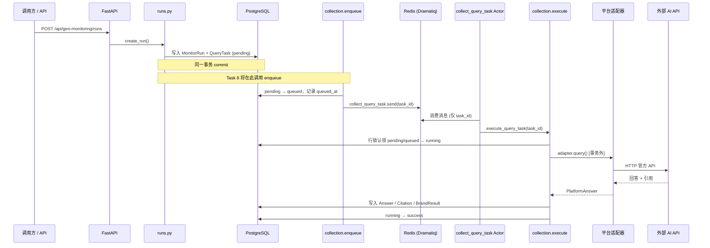
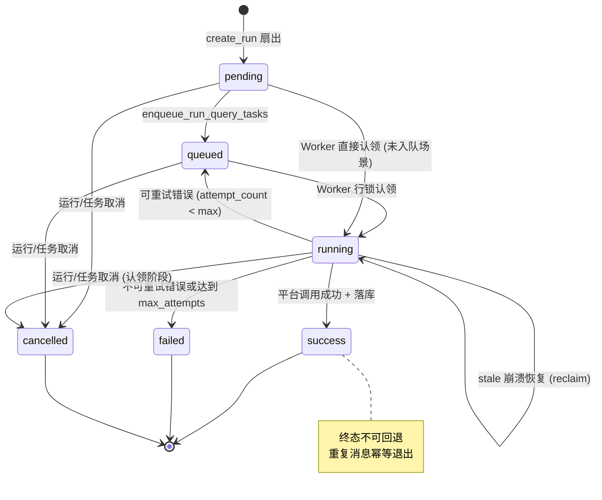

# 采集任务生命周期说明

> **文档版本：** MVP V2 Task 7 完成后  
> **适用范围：** 后端采集域（`MonitorRun` → `QueryTask` → `Answer`）  
> **相关代码：** `backend/app/geo_monitoring/services/`、`backend/app/worker/`

本文档描述一次监测运行从 API 创建到 QueryTask 采集完成的**完整步骤**，包括数据库写入、消息队列、Worker 执行、平台 API 调用与结果落库。文中同时标注 **Task 8 尚未接入** 的运行级能力，避免与当前实现混淆。

---

## 1. 核心概念

| 概念 | 表 / 模型 | 说明 |
|------|-----------|------|
| **监测项目** | `geo_monitor_project` / `MonitorProject` | 品牌、Prompt 集、运行的归属容器 |
| **监测运行** | `geo_monitor_run` / `MonitorRun` | 一次完整的采集批次，包含 N 条 QueryTask |
| **查询任务** | `geo_query_task` / `QueryTask` | 单个「Prompt × AI 平台」采集单元，异步执行 |
| **答案** | `geo_answer` / `Answer` | 平台返回文本及元数据，与 QueryTask 1:1 |
| **引用** | `geo_answer_citation` / `AnswerCitation` | 答案中的来源链接，按顺序编号 |
| **品牌识别结果** | `geo_answer_brand_result` / `AnswerBrandResult` | 规则匹配后的品牌提及记录 |

一次运行的任务数量：

```text
total_tasks = 启用 Prompt 数 × 启用 AI 平台数
```

---

## 2. 前置条件

在创建运行之前，项目侧需满足：

1. **项目** 状态为 `active`
2. **Prompt 集** 存在且有一个 `active` 版本，且至少有一条 `enabled` 的 Prompt
3. **AI 平台** 在 `geo_ai_platform` 中已配置且 `enabled = true`
4. **品牌**（可选但推荐）已配置目标品牌、竞品及别名，供采集后规则匹配
5. **环境变量** 已配置：
   - `DATABASE_URL` — PostgreSQL
   - `REDIS_URL` — Dramatiq 消息 broker
   - 各平台 `*_ENABLED`、`*_MODEL`、`*_API_KEYS`（或元宝 `YUANBAO_CREDENTIALS_JSON`）

---

## 3. 端到端流程总览



---

## 4. 分阶段详解

### 阶段 0：配置域准备（运行创建前）

用户通过配置 API 维护项目数据（与采集 Worker 无直接耦合）：

| 步骤 | API 示例 | 产出 |
|------|----------|------|
| 创建项目 | `POST /api/geo-monitoring/projects` | `project_id` |
| 配置品牌 | `POST .../projects/{id}/brands` | 目标品牌 / 竞品 |
| 配置别名 | `POST .../brands/{id}/aliases` | `exact` / `contains` / `context` 匹配规则 |
| 创建 Prompt 集 | `POST .../projects/{id}/prompt-sets` | `prompt_set_id` |
| 添加 Prompt | `POST .../prompt-sets/{id}/prompts` | 问题文本 |
| 激活 Prompt 集 | `POST .../prompt-sets/{id}/activate` | 版本锁定为 `active` |
| 启用平台 | `PATCH /api/geo-monitoring/platforms/{code}` | 平台可用 |

---

### 阶段 1：创建监测运行

**入口：** `POST /api/geo-monitoring/runs`  
**服务：** `backend/app/geo_monitoring/services/runs.py` → `create_run()`

#### 1.1 校验

| 校验项 | 失败码 | 说明 |
|--------|--------|------|
| 项目不存在或非 active | 业务异常 | `require_active_project` |
| 无 active Prompt 集 | 40030 | |
| Prompt 集内无启用 Prompt | 40901 | |
| 指定平台不可用 | 40031 | |
| 无任何启用平台 | 40902 | |

#### 1.2 写入 MonitorRun

在同一数据库事务中创建运行记录，初始状态：

| 字段 | 初始值 |
|------|--------|
| `run_no` | `RUN-{UTC时间}-{随机8位}` |
| `status` | `pending` |
| `collection_status` | `pending` |
| `analysis_status` | `skipped` |
| `report_status` | `skipped` |
| `expected_query_count` / `total_tasks` | Prompt 数 × 平台数 |
| `platform_codes` | 参与平台编码列表 |
| `prompt_set_version` | 当前激活版本号 |

#### 1.3 扇出 QueryTask

**仓储：** `repositories/runs.py` → `build_query_tasks()`

对每个 `(prompt, platform)` 组合插入一条 `QueryTask`：

| 字段 | 值 |
|------|-----|
| `status` | `pending` |
| `idempotency_key` | `SHA256(run_no:prompt_id:platform_code)` |
| `max_attempts` | 默认 3（库表 server_default） |
| `attempt_count` / `retry_count` | 0 |
| `request_json` | Prompt 元数据快照（code、text、type 等） |

> **设计要点：** Prompt 全文保存在 `request_json` 中作为快照，但 **Dramatiq 消息不携带 Prompt 文本**；Worker 执行时从 `geo_prompt` 表重新读取最新 `prompt_text`，保证执行期数据一致。

#### 1.4 事务提交

```text
BEGIN
  INSERT MonitorRun
  INSERT QueryTask × N
COMMIT
```

当前 Task 7 完成后，`create_run()` **到此结束**，不会自动入队。  
Task 8 将在 `commit` 成功后调用 `enqueue_run_query_tasks(run.id)`。

---

### 阶段 2：任务入队

**服务：** `backend/app/geo_monitoring/services/collection.py` → `enqueue_run_query_tasks(run_id)`

#### 2.1 状态迁移（短事务）

```text
SELECT QueryTask WHERE run_id = ? AND status = 'pending'
FOR EACH task:
  status  = 'queued'
  queued_at = now()
COMMIT
```

**原则：** 必须先 `commit`，再向 Redis 发送消息，避免 Worker 读到未提交数据。

#### 2.2 发送 Dramatiq 消息

**Actor：** `backend/app/worker/actors/collection.py`

```python
collect_query_task.send(task_id)  # 消息体仅含整数 task_id
```

| 约束 | 说明 |
|------|------|
| 消息载荷 | 仅 `task_id`，不含密钥、Prompt 全文、ORM 对象 |
| 队列名 | `collection` |
| Broker | 生产环境 `RedisBroker(REDIS_URL)`；测试环境 `StubBroker` |
| max_retries | 0（重试由业务层 `attempt_count` / `max_attempts` 控制） |

---

### 阶段 3：Worker 消费

#### 3.1 启动 Worker 进程

生产联调需单独启动 Dramatiq worker（示例）：

```powershell
cd backend
.venv\Scripts\python.exe -m dramatiq app.worker.actors.collection --processes 1 --threads 4
```

依赖：

- PostgreSQL 可连（读写任务状态）
- Redis 可连（消费队列）
- `.env` 中平台密钥已配置

#### 3.2 Actor 调度

```text
collect_query_task(task_id)
  └─ asyncio.run(execute_query_task(task_id))
       └─ 若返回 should_retry=True → collect_query_task.send(task_id)
```

Actor 同步包装异步采集逻辑；重试入队在 `asyncio.run` **结束之后** 执行，避免嵌套事件循环。

---

### 阶段 4：行锁认领任务

**函数：** `_claim_task_for_execution()`

```text
SELECT QueryTask WHERE id = ? FOR UPDATE
```

#### 4.1 幂等退出（直接返回，不调用外部 API）

| 条件 | 行为 |
|------|------|
| 任务不存在 | 退出 |
| `status ∈ {success, failed, cancelled}` | 退出 |
| 运行 `status = cancelled` | 任务置 `cancelled`，退出 |
| 任务 `status = cancelled` | 退出 |
| 已有 Answer 记录 | 任务补标 `success`，退出 |
| `status = running` 且未超时 | 退出（防并发重复执行） |

#### 4.2 崩溃恢复

| 条件 | 行为 |
|------|------|
| `status = running` 且 `started_at` 超过 `COLLECTION_REQUEST_TIMEOUT_SECONDS × 2` | 视为 stale，允许 reclaim，**不增加** `attempt_count` |

#### 4.3 正常认领

| 原状态 | 新状态 | 其他更新 |
|--------|--------|----------|
| `pending` / `queued` | `running` | `attempt_count += 1`，`started_at = now()` |

Aidso `PENDING` 轮询重试复用已提交的 `aidso_req_id`，不增加 `attempt_count`；轮询次数记录在 `request_json.aidso_poll_count`，受 `COLLECTION_AIDSO_MAX_POLLS` 限制。

认领成功后构建不可变 `TaskSnapshot`（含 prompt_text、model_name、project_id 等），**关闭 DB Session**，后续不再持有 ORM 对象跨 `await`。

---

### 阶段 5：调用平台 API（事务外）

**函数：** `_collect_platform_answer()`

```text
1. adapter_registry.get(platform_code)
2. key_pool.acquire(platform_code, request_id=idempotency_key)
3. adapter.query(PlatformQuery, credential=...)
4. 成功 → key_pool.report_success
   失败 → key_pool.report_failure → 抛出 AdapterError
```

#### 5.1 平台适配器

| 平台 | 适配器文件 | 协议 |
|------|------------|------|
| 通义千问 | `adapters/qwen.py` | OpenAI-compatible |
| 豆包 | `adapters/doubao.py` | OpenAI-compatible |
| DeepSeek | `adapters/deepseek.py` | OpenAI-compatible |
| Kimi | `adapters/kimi.py` | OpenAI-compatible |
| 腾讯元宝 | `adapters/yuanbao.py` | 腾讯云 API |

统一返回 `PlatformAnswer`：

```python
PlatformAnswer(
    text: str,              # 回答正文
    citations: list[dict],  # 引用列表
    model: str,
    usage: dict,            # token 统计
    latency_ms: int,
    provider_request_id: str | None,
    raw_response: dict | None,
)
```

#### 5.2 密钥池

`CredentialKeyPool` 通过 Redis 轮询密钥，支持：

- `healthy` / `cooling` / `disabled` 状态
- 401/403 → 禁用密钥
- 429 → 冷却
- Redis 不可用时降级为进程内轮询

> **硬约束：** 此阶段 **不得** 持有数据库 Session，不得在数据库长事务内调用外部 API。

---

### 阶段 6：结果落库（单事务）

**函数：** `_persist_success()`

在**新的**数据库 Session 中，于单个事务内完成：

#### 6.1 写入 Answer

| 字段 | 来源 |
|------|------|
| `raw_text` | 平台原始文本 |
| `normalized_text` | `normalize_answer_text()` 标准化后文本 |
| `model_name` | 实际模型 |
| `prompt_tokens` / `completion_tokens` / `total_tokens` | usage |
| `latency_ms` | 平台耗时 |
| `raw_response_json` | 脱敏原始响应（受 `COLLECTION_RAW_RESPONSE_ENABLED` 控制） |

#### 6.2 写入引用 AnswerCitation

对每条 citation：

1. `normalize_citation_url()` — 去 fragment、小写 host、去默认端口
2. `extract_domain()` — 提取域名
3. 按 `citation_no` 从 1 递增写入

#### 6.3 品牌规则匹配 AnswerBrandResult

**服务：** `brand_matcher.py`

对项目下所有 `active` 品牌：

| 匹配对象 | 默认模式 |
|----------|----------|
| `brand_name` | `contains` |
| 启用别名 | 别名配置的 `match_mode` |

| match_mode | 规则 |
|------------|------|
| `exact` | 整词匹配（正则边界） |
| `contains` | 子串计数 |
| `context` | 子串存在 + 上下文关键词命中 |

每个品牌写入一条 `AnswerBrandResult`（含 `is_mentioned`、`mention_count`、`first_position`、`context_json`）。

#### 6.4 更新 QueryTask 终态

```text
status            = success
response_http_status = 200
latency_ms        = 平台耗时
provider_request_id = 平台请求 ID
completed_at / finished_at = now()
error_code / error_message = NULL
COMMIT
```

---

### 阶段 7：失败与重试

**函数：** `_handle_adapter_failure()`

#### 7.1 错误分类

| ErrorCategory | 可重试 | 典型场景 |
|---------------|--------|----------|
| `rate_limited` | 是 | HTTP 429 |
| `server_error` | 是 | HTTP 5xx |
| `network_error` | 是 | 连接超时 |
| `unauthorized` | 否 | 401/403，密钥禁用 |
| `invalid_request` | 否 | 400 参数错误 |
| `content_safety` | 否 | 内容安全拦截 |
| `unknown` | 否 | 未分类异常 |

#### 7.2 重试路径

```text
IF is_retryable AND attempt_count < max_attempts:
  status      = queued
  retry_count += 1
  started_at  = NULL
  COMMIT
  RETURN should_retry=True  → Actor 重新 send(task_id)
ELSE:
  status = failed
  error_code / error_message / last_error_* 写入
  completed_at / finished_at = now()
  COMMIT
```

#### 7.3 失败状态示例

```text
QueryTask:
  status: failed
  error_code: server_error
  error_message: [脱敏后的错误信息]
  attempt_count: 3
  max_attempts: 3
```

Task 8 将提供 `POST /runs/{id}/retry-failed`，把失败任务重置后再入队。

---

### 阶段 8：运行级聚合（Task 8 规划，当前未实现）

当所有 QueryTask 进入终态后，Run 级状态应聚合为：

```text
MonitorRun.status:
  pending → collecting → completed | partial_success | failed | cancelled
```

| Run 终态 | 条件（规划） |
|----------|--------------|
| `completed` | 全部任务 success |
| `partial_success` | 部分 success、部分 failed |
| `failed` | 全部 failed 或无有效答案 |
| `cancelled` | 用户取消 |

Task 8 还将实现：

- `POST /runs/{id}/cancel` — 取消未完成任务
- 更新 `succeeded_tasks` / `failed_tasks` / `cancelled_tasks` 计数
- `progress_rate` 实时计算

---

## 5. 状态机

### 5.1 QueryTask 状态机（已实现）



### 5.2 MonitorRun 状态机（部分实现）

| 状态 | 当前 | Task 8 |
|------|------|--------|
| `pending` | 创建时写入 | 保持 |
| `collecting` | 未自动迁移 | 入队后迁移 |
| `completed` / `partial_success` / `failed` / `cancelled` | 未聚合 | 任务全部终态后计算 |

---

## 6. 查询采集结果

以下 API 在 Task 3 已实现，Task 8 将补充生命周期操作：

| 用途 | 方法 | 路径 |
|------|------|------|
| 运行详情 | GET | `/api/geo-monitoring/runs/{id}` |
| 任务列表 | GET | `/api/geo-monitoring/runs/{id}/tasks` |
| 答案列表 | GET | `/api/geo-monitoring/runs/{id}/answers` |
| 答案详情（含引用、品牌） | GET | `/api/geo-monitoring/answers/{id}` |

**有效答案定义（技术文档口径）：**

```text
QueryTask.status = success
AND Answer.normalized_text 去空白后非空
AND QueryTask 未取消
```

---

## 7. 数据表关系

```text
MonitorProject
    ├── Brand ── BrandAlias
    ├── PromptSet ── Prompt
    └── MonitorRun
            └── QueryTask (prompt_id, platform_code)
                    └── Answer (1:1, UNIQUE task_id)
                            ├── AnswerCitation (1:N)
                            └── AnswerBrandResult (N:1 Brand)
```

**关键唯一约束：**

| 约束 | 作用 |
|------|------|
| `uq_geo_query_task (run_id, prompt_id, platform_code)` | 同一运行不重复扇出 |
| `QueryTask.idempotency_key UNIQUE` | 全局幂等键 |
| `uq_geo_answer_task (task_id)` | 一任务一答案 |
| `uq_geo_answer_citation (answer_id, citation_no)` | 引用顺序唯一 |
| `uq_geo_answer_brand_result (answer_id, brand_id)` | 每品牌一条结果 |

---

## 8. 关键代码索引

| 步骤 | 文件 | 函数 / 类 |
|------|------|-----------|
| 创建运行 | `services/runs.py` | `create_run()` |
| 扇出任务 | `repositories/runs.py` | `build_query_tasks()` |
| 入队 | `services/collection.py` | `enqueue_run_query_tasks()` |
| Dramatiq Broker | `worker/broker.py` | `create_broker()` |
| Actor | `worker/actors/collection.py` | `collect_query_task` |
| 执行主流程 | `services/collection.py` | `execute_query_task()` |
| 行锁认领 | `services/collection.py` | `_claim_task_for_execution()` |
| 平台调用 | `services/collection.py` | `_collect_platform_answer()` |
| 结果落库 | `services/collection.py` | `_persist_success()` |
| 失败处理 | `services/collection.py` | `_handle_adapter_failure()` |
| 文本标准化 | `services/brand_matcher.py` | `normalize_answer_text()` |
| 品牌匹配 | `services/brand_matcher.py` | `match_brands_in_text()` |
| URL 标准化 | `services/collection.py` | `normalize_citation_url()` |
| 适配器注册 | `adapters/registry.py` | `build_adapter_registry()` |
| 密钥池 | `adapters/key_pool.py` | `CredentialKeyPool` |

---

## 9. 完整步骤清单（Checklist）

以下是从零到任务完成的操作顺序，供联调与验收使用：

- [ ] **1.** 配置 `.env`：`DATABASE_URL`、`REDIS_URL`、平台密钥
- [ ] **2.** 启动 PostgreSQL、Redis
- [ ] **3.** 执行数据库迁移：`alembic upgrade head`
- [ ] **4.** 启动 FastAPI：`uvicorn app.main:app`
- [ ] **5.** 启动 Dramatiq Worker：`dramatiq app.worker.actors.collection`
- [ ] **6.** 创建项目、品牌、Prompt 集并激活
- [ ] **7.** 确认 AI 平台已启用
- [ ] **8.** `POST /runs` 创建运行 → 得到 `run_id`
- [ ] **9.** 调用 `enqueue_run_query_tasks(run_id)`（Task 8 后由 API 自动触发）
- [ ] **10.** Worker 消费消息，任务 `pending → queued → running`
- [ ] **11.** 适配器调用外部平台 API
- [ ] **12.** 落库 Answer + Citation + BrandResult
- [ ] **13.** 任务 `running → success`（或 `failed` / `cancelled`）
- [ ] **14.** `GET /runs/{id}/tasks` 确认任务状态
- [ ] **15.** `GET /answers/{id}` 查看回答、引用与品牌识别
- [ ] **16.** （Task 8）Run 聚合为 `completed` / `partial_success`

---

## 10. 当前实现边界

| 能力 | 状态 | 说明 |
|------|------|------|
| 创建运行 + 扇出 QueryTask | ✅ 已实现 | `POST /runs` |
| 异步入队 + Worker 采集 | ✅ 已实现 | 需手动调用 `enqueue_run_query_tasks` |
| 创建运行后自动入队 | ⏳ Task 8 | `create_run` commit 后挂钩 |
| Run 状态聚合 | ⏳ Task 8 | `collecting` / `partial_success` 等 |
| 取消运行 | ⏳ Task 8 | `POST /runs/{id}/cancel` |
| 重试失败任务 | ⏳ Task 8 | `POST /runs/{id}/retry-failed` |
| Agent 分析 | ⏳ Task 12+ | `analysis_status` 当前为 `skipped` |
| 报告生成 | ⏳ Task 16+ | `report_status` 当前为 `skipped` |

---

## 11. 相关文档

- 任务书：`docs/AI应用监测_MVP_Cursor实施任务V2.md`（Task 7 §639–693，Task 8 §694–752）
- 架构口径：`AI应用监测_技术开发文档.md` §9 回答与标准化、§10 确定性指标
- 工程规则：`CLAUDE.md`、`AGENTS.md`
